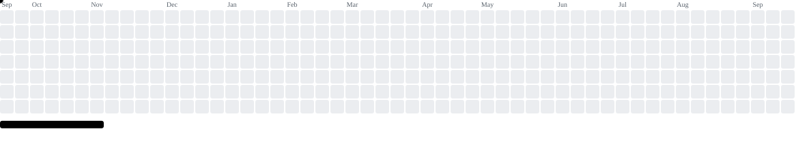
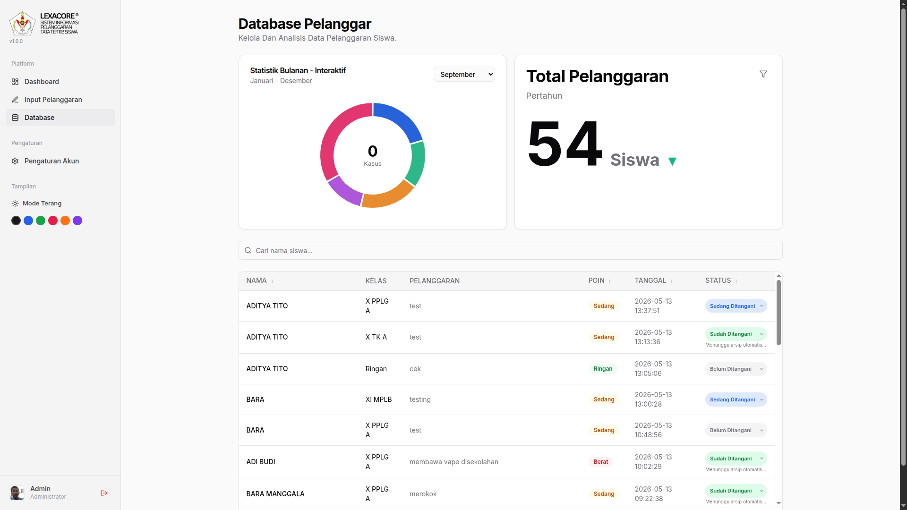
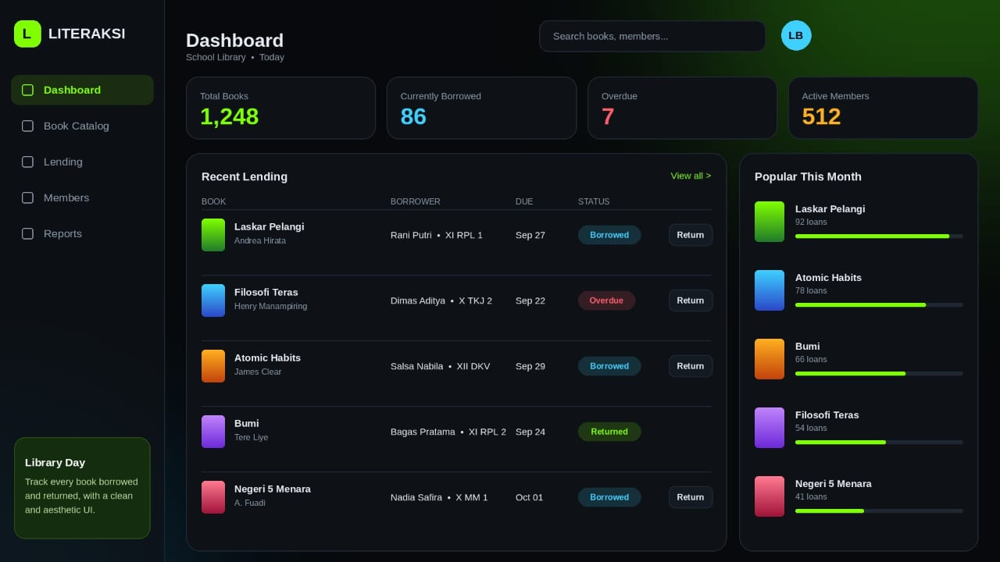

  Student at <b>SMK Negeri 5 Surakarta</b> who loves turning ideas into clean, aesthetic interfaces. 
  I build school-focused web apps like <b>LEXACORE</b> and <b>LITERAKSI</b> with HTML, CSS and JavaScript, 
  and I'm always exploring better UI/UX.

  

<!-- Stats: two images at 49% each so the row is as wide as the breakout graph below -->

  

 

<h2>Projects</h2>

 

<table>
  <tr>
    <td align="center" valign="top" width="50%">
      <h3>LEXACORE&nbsp;&nbsp;</h3>
      

        A school rule-violation tracker with a clean, aesthetic dashboard. 
        Record violations per student, see totals and breakdowns at a glance, 
        and search a full violation database in seconds.
      

      
      
    </td>
    <td align="center" valign="top" width="50%">
      <h3>LITERAKSI&nbsp;&nbsp;</h3>
      

        A school library lending tracker built for speed and looks. 
        Manage the book catalog, log who borrowed what, 
        catch overdue returns and spot the most popular titles.
      

      
      
    </td>
  </tr>
</table>

